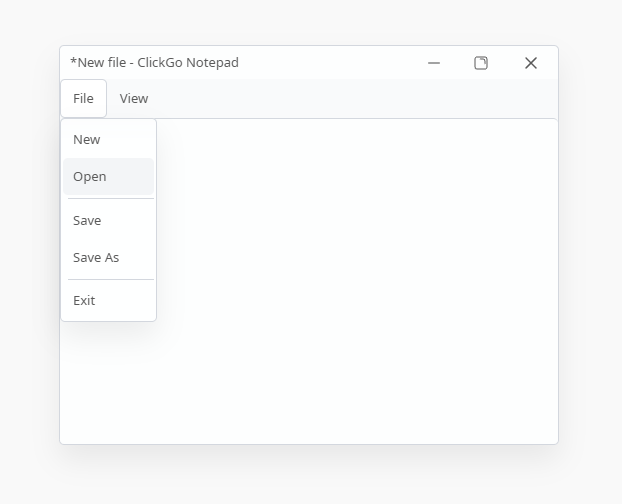

# ClickGo Notepad
A lightweight text editor for web and desktop, primarily showcasing the ClickGo framework series.

## Run

Run `npm run native` to start the app.

## Build

Run `npm run build` to build the app.

## Description
This project is a demonstration of how to use *ClickGo Native* to compile *ClickGo* projects for *macOS*, *Windows*, and *Linux*. Please note: the project itself is not a production-ready application and serves no practical purpose beyond showcasing the build process.

## License
This project is published under [AGPL-3.0](./LICENSE) license.
