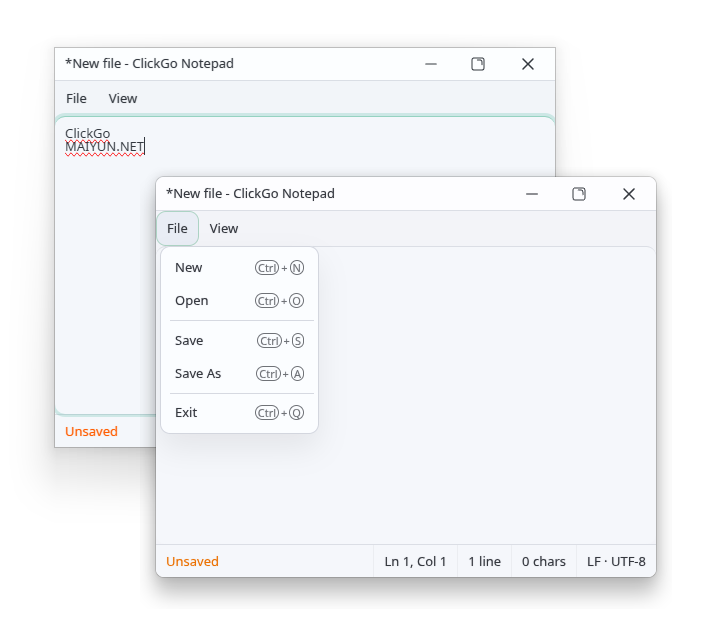

# ClickGo Notepad
A lightweight text editor for web and desktop, primarily showcasing the ClickGo framework series.

<p align="center"></p>

You need to install [ClickGo Compiler](https://github.com/maiyun/clickgo-compiler) globally first.

```sh
npm install -g clickgo-compiler
```

## Run

Install dependencies with `npm install`, then run `npm run build` to compile TypeScript and generate `dist/app.cga`.

Run `clickgo --run ./dist/index` to start the app.

## Build

Run `clickgo --native` to build the app.

### CN Mirror

Run `clickgo --native --mirror cn`.

## Update checks

Installed desktop builds check for new versions at startup. Select **View → Check for Updates** (`Ctrl+U`) to check manually. When an update is available, choose **Download**, then **Restart and Install**. Unsaved documents must be saved before installation. Choose **Later** to continue working; check again to install an already downloaded update. Updates are disabled in web, development, and Windows portable builds.

Configure the update source using `build.publish` in [package.json](./package.json). Update metadata examples for each platform are in [yml/](./yml/README.md). For release setup and publishing instructions, see the [electron-updater guide](https://www.electron.build/v26/docs/features/auto-update/).

## Description
This project is a demonstration of how to use *ClickGo Native* to compile *ClickGo* projects for *macOS*, *Windows*, and *Linux*. Please note: the project itself is not a production-ready application and serves no practical purpose beyond showcasing the build process.

## License
This project is published under [AGPL-3.0](./LICENSE) license.
